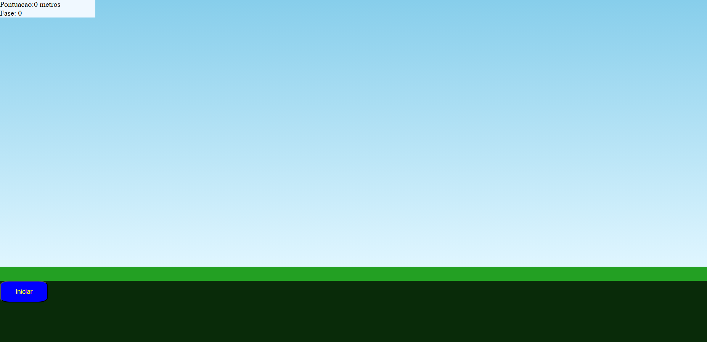
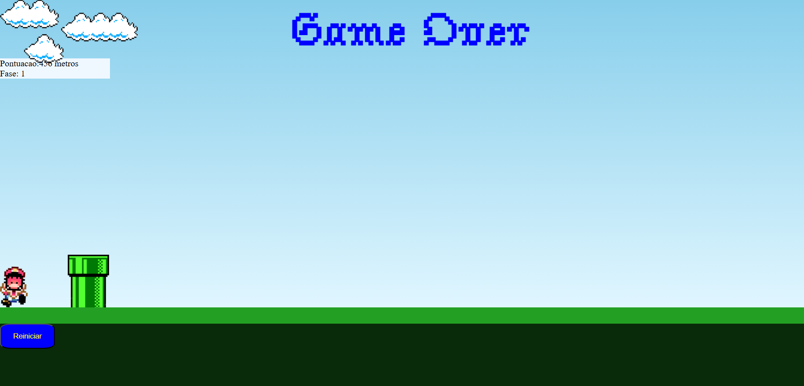

# 🎮 Projeto: Mini Jogo do Mario — Animação, Obstáculos e Pulo
---
## 📝 Sobre o Projeto
---
Este projeto é um jogo simples do Mario, desenvolvido como atividade prática no curso de Desenvolvimento de Sistemas, no módulo de Introdução ao Front-End.
O jogo foi construído em conjunto com o professor, em tempo real, como forma de aprender fundamentos de:

- HTML
- CSS
- JavaScript
- Animações
- Manipulação do DOM
- Eventos de teclado
---
O objetivo do jogo é desviar dos obstáculos, pular no momento certo e avançar pelas três fases disponíveis.

🎯 Funcionalidades
🕹️ Controle do Mario: o personagem pode pular para evitar obstáculos.
🧱 Obstáculos animados com movimento lateral.
🌄 Três fases com dificuldade progressiva.
🎵 Efeitos sonoros.
💥 Sistema de colisão simples para detectar quando o jogador perde.
🛠️ Tecnologias Utilizadas

## Como Executar o Projeto

1. Faça o download ou clone este repositório:
2. Abra o arquivo index.html no navegador.
3. Comece a jogar!

## Demonstração

## Créditos

Projeto desenvolvido em sala de aula, em conjunto com o professor, como atividade prática para aprendizado.

### Licença

Este projeto é livre para estudos.
